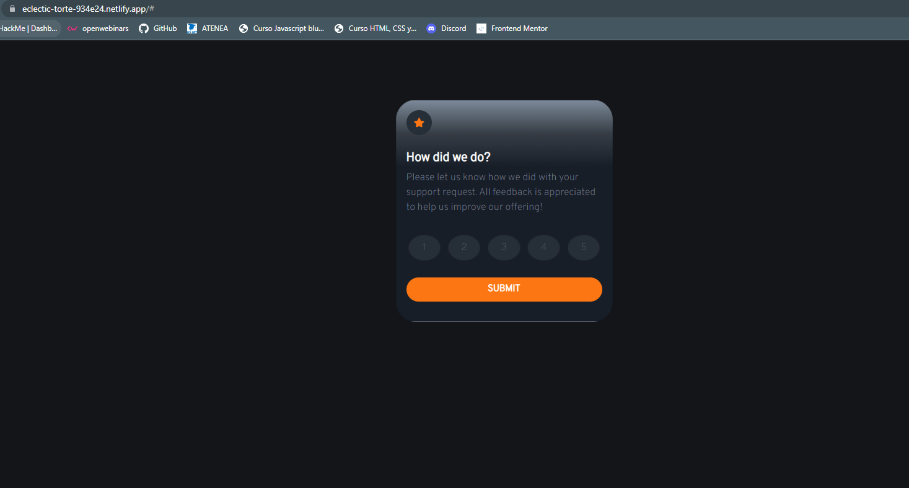
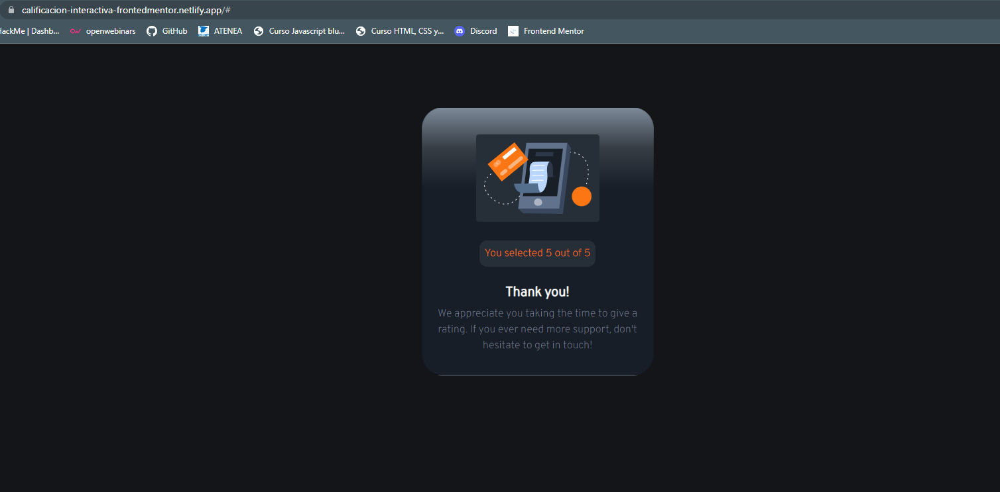

# Frontend Mentor - Interactive rating component solution

This is a solution to the [Interactive rating component challenge on Frontend Mentor](https://www.frontendmentor.io/challenges/interactive-rating-component-koxpeBUmI). Frontend Mentor challenges help you improve your coding skills by building realistic projects. 

## Table of contents

- [Overview](#overview)
  - [The challenge](Interactive rating component)
  - [Links](https://calificacion-interactiva-frontedmentor.netlify.app/)
- [My process](#my-process)
  - [Built with](boostrap5, sass)
  - [What I learned](maquetacion con boostrap5 )
  - [Useful resources](bluuweb)
- [Author](Alvaro Escobar D (AYED2409))

## Overview

### The challenge

Users should be able to:

- View the optimal layout for the app depending on their device's screen size
- See hover states for all interactive elements on the page
- Select and submit a number rating
- See the "Thank you" card state after submitting a rating

### Screenshot

### Links

- Solution URL: [https://github.com/AYED2409/Calificacion-interactiva.git]
- Live Site URL: [https://calificacion-interactiva-frontedmentor.netlify.app/]

### Built with

- CSS custom properties
- CSS Grid
- BOOSTRAP5
- SASS

## Author

- Website - [AYED2404- Álvaro Escobar D. ](https://github.com/AYED2409/)
- Frontend Mentor - [AYED2409](https://www.frontendmentor.io/profile/AYED2409)

